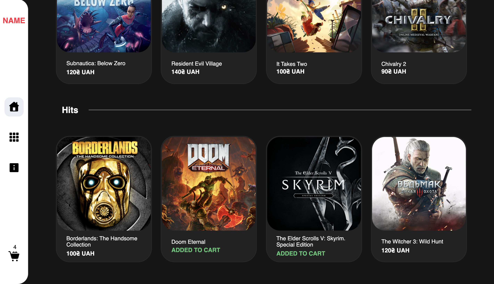

# Catalogue Site: Games

This is the **`catalogue site`** with games! Below you can look at the index page. 
It contains a search bar, a big slider, categories to quick navigation and some compilations.

-------
### In the left side there is a sidebar. With it help a visitor can switch between 4 pages:
- index page
- page with all products
- info page
- cart

Page with all products + active search bar (screenshot above). It contains a filter too.

Cart (with memory)

------

And the photo of adaptive look.
